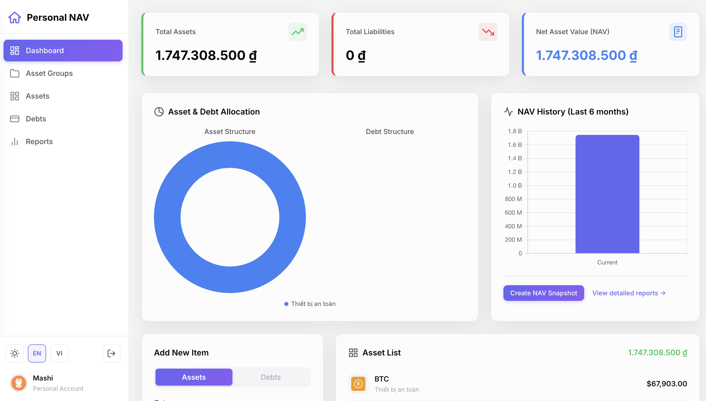
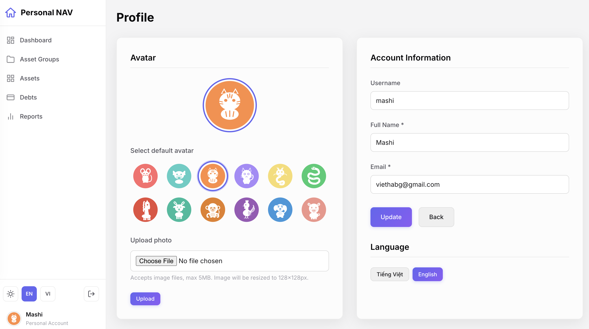

# Personal NAV - Personal Asset Management System

> **Built entirely through vibe coding with AI.** From architecture to implementation, every line of code in this project was generated through natural language conversations with Claude (Anthropic). No manual coding — just describe what you want, and the AI builds it.

A comprehensive personal asset management system for tracking assets, debts, and calculating Net Asset Value (NAV).



## Features

- **Dark/Light Theme** — Professional dark theme by default with light mode toggle, preference persisted via localStorage
- **Sidebar Navigation** — Fixed sidebar with icon-based nav links, collapsible on mobile with hamburger menu and overlay
- **Glassmorphism UI** — Cards with backdrop blur, subtle borders, and entrance animations
- **Authentication** — Secure login/registration with Remember Me (up to 30 days)
- **Asset Group Management** — Organize assets by category (real estate, savings, stocks, crypto, etc.)
  - Data protection: groups with existing assets cannot be deleted
  - Custom icons: 10+ built-in icons, plus custom icon upload (128x128px)
  - Per-group currency: each group has its own currency, assets inherit it automatically
- **Asset Management** — Create, edit, delete assets with value and quantity tracking
- **Price History** — Automatic price change tracking over time
- **Debt Management** — Track debts with interest rates and due dates
- **Multi-Currency** — VND and USD support with configurable exchange rates. Reporting currency is VND
- **NAV Calculation** — Automatic net asset value computation (all currencies converted to VND)
- **Reports & Charts** — Monthly/yearly NAV charts, asset allocation donuts, debt breakdowns (Chart.js with theme-aware colors)
- **NAV Snapshots** — Save point-in-time NAV states to track trends over time
- **User Profile** — Default or custom avatar, personal info management
- **Multi-language** — English (default) and Vietnamese, switchable via sidebar or profile settings
- **Responsive Design** — Mobile-first with topbar, off-canvas sidebar, and adaptive grid layouts



## Tech Stack

| Layer | Technology |
|-------|-----------|
| Runtime | Node.js + TypeScript |
| Web Framework | Express |
| Views | EJS (Server-side rendering) with Inter font |
| Database | SQLite via TypeORM |
| Auth | bcryptjs + express-session |
| Charts | Chart.js |
| Image Processing | sharp + multer |

## Getting Started

### Prerequisites

- Node.js 18+

### Step 1: Install dependencies

```bash
npm install
```

### Step 2: Configure environment

Copy the example env file:

```bash
cp .env.example .env
```

Edit `.env` as needed:

| Variable | Default | Description |
|----------|---------|-------------|
| `PORT` | `3000` | Server port |
| `NODE_ENV` | `development` | Environment |
| `DB_DATABASE` | `./data/personal_nav.sqlite` | SQLite file path |
| `SESSION_SECRET` | — | Session encryption key (change in production) |

Uses SQLite — no external database server required.

### Step 3: Run

```bash
# Development (auto-reload via nodemon)
npm run dev

# Production
npm run build
npm start
```

Open [http://localhost:3000](http://localhost:3000) in your browser.

## Project Structure

```
src/
├── config/
│   ├── database.ts        # TypeORM DataSource configuration
│   └── currencies.ts      # Currency definitions and conversion helpers
├── controllers/           # HTTP request handlers
├── middleware/
│   └── auth.ts            # requireAuth / redirectIfAuth guards
├── models/                # TypeORM entities
│   ├── User.ts
│   ├── AssetGroup.ts
│   ├── Asset.ts
│   ├── Debt.ts
│   ├── PriceHistory.ts
│   └── NAVSnapshot.ts
├── routes/                # Express route definitions
├── services/              # Business logic layer
├── views/                 # EJS templates
│   ├── partials/          # Header, footer, flash messages
│   ├── auth/              # Login, register
│   ├── dashboard/         # Overview, reports
│   ├── asset-groups/      # CRUD + detail view
│   ├── assets/            # CRUD + price history
│   ├── debts/             # CRUD
│   └── profile/           # User profile
├── public/                # Static assets (CSS with dark/light theming, JS, images)
└── index.ts               # Entry point
```

## Multi-Currency

Currencies are configured in `src/config/currencies.ts`. Each asset group has a currency set at creation — all assets in the group inherit it. Changing a group's currency automatically updates all its assets.

To add a new currency, add an entry to the `currencies` array:

```typescript
{ code: 'EUR', name: 'Euro', symbol: '\u20ac', locale: 'de-DE', rateToVND: 27000 }
```

All totals (dashboard, NAV, reports) are converted to VND as the reporting currency.

## Usage

1. **Register** at `/auth/register`
2. **Log in** at `/auth/login`
3. **Create asset groups** (Asset Groups > Add New) — choose type, currency, icon
4. **Add assets** to groups — price history is saved automatically on every update
5. **Add debts** with amount, interest rate, due date
6. **View reports** — monthly/yearly NAV charts, asset allocation breakdowns
7. **Create NAV snapshots** from the Dashboard to save current state

## Routes

### Authentication
- `GET/POST /auth/login` — Log in
- `GET/POST /auth/register` — Register
- `GET /auth/logout` — Log out

### Dashboard
- `GET /dashboard` — Overview
- `GET /dashboard/reports` — Statistics & reports
- `POST /dashboard/snapshot` — Create NAV snapshot

### Asset Groups
- `GET /asset-groups` — List groups
- `GET /asset-groups/create` — Create form
- `POST /asset-groups` — Create group
- `GET /asset-groups/:id` — Group detail
- `GET /asset-groups/:id/edit` — Edit form
- `POST /asset-groups/:id` — Update group
- `POST /asset-groups/:id/delete` — Delete group

### Assets
- `GET /assets` — List assets
- `GET /assets/create` — Create form
- `POST /assets` — Create asset
- `GET /assets/:id/edit` — Edit form
- `POST /assets/:id` — Update asset
- `POST /assets/:id/delete` — Delete asset
- `GET /assets/:id/history` — Price history
### Debts
- `GET /debts` — List debts
- `GET /debts/create` — Create form
- `POST /debts` — Create debt
- `GET /debts/:id/edit` — Edit form
- `POST /debts/:id` — Update debt
- `POST /debts/:id/delete` — Delete debt

## Security

- Passwords hashed with bcryptjs
- Session-based authentication
- Auth middleware guards on all protected routes
- SQL injection prevention via TypeORM parameterized queries
- XSS protection via EJS output escaping
- Data integrity: asset groups with existing assets cannot be deleted

## Vibe Coding with AI

This entire project was built through conversational AI development — a workflow sometimes called "vibe coding." Instead of writing code manually, features were described in natural language and implemented by Claude. This includes:

- Architecture design (MVC + Service Layer)
- Database schema and TypeORM entities
- All controllers, services, and routes
- EJS views with sidebar layout, dark/light theming, glassmorphism CSS
- Chart.js dashboard visualizations with theme-aware colors
- Multi-currency conversion system
- Authentication and session management

The Vietnamese UI, the favicon, the CSS layout fixes, and the dark-mode dashboard pro redesign — all done through conversation. The `CLAUDE.md` file in the repo serves as persistent context for the AI across sessions.

## License

MIT
